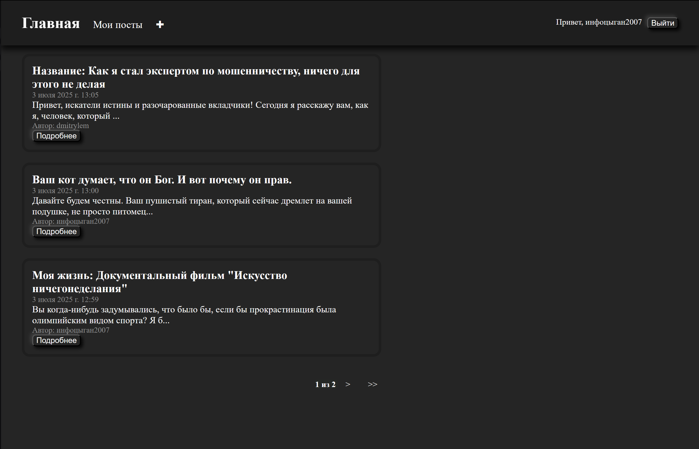
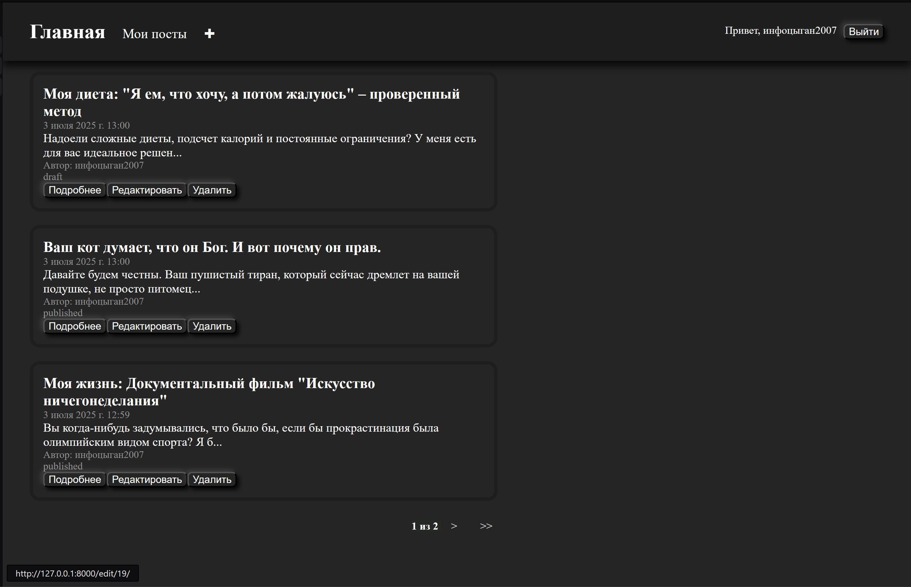
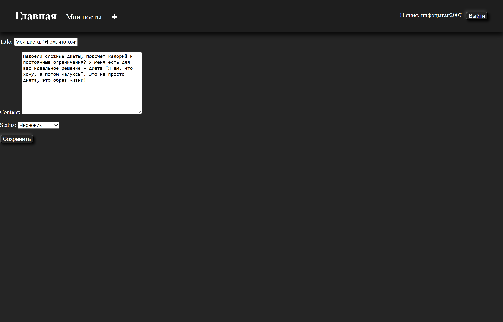
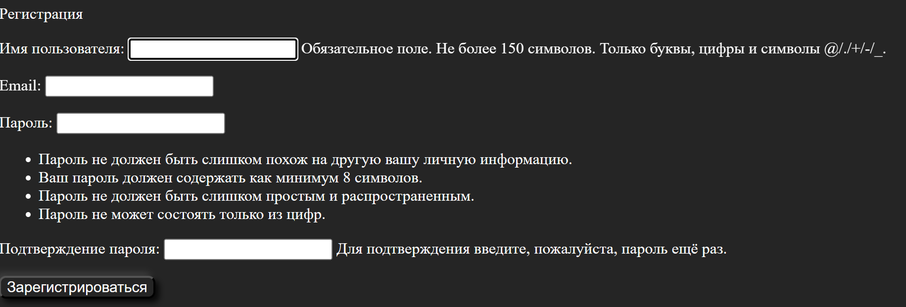

# Веб-приложение для ведения блога на django

В проекте реализованы ключевые концепции Django такие, как архитектура MVT, Django ORM,
URL-маршрутизация, шаблоны, формы, админ-панель и аутентификация пользователей.

## Использование
После запуска приложения:

Главная страница: Отображает список постов.

Мои посты: Список постов конкретного пользователя, включающий черновики.

Регистрация: Создайте новую учетную запись пользователя.

Вход: Войдите в систему, чтобы получить доступ к функциям создания, редактирования и удаления постов.

Админ-панель: Управляйте постами и пользователями.

